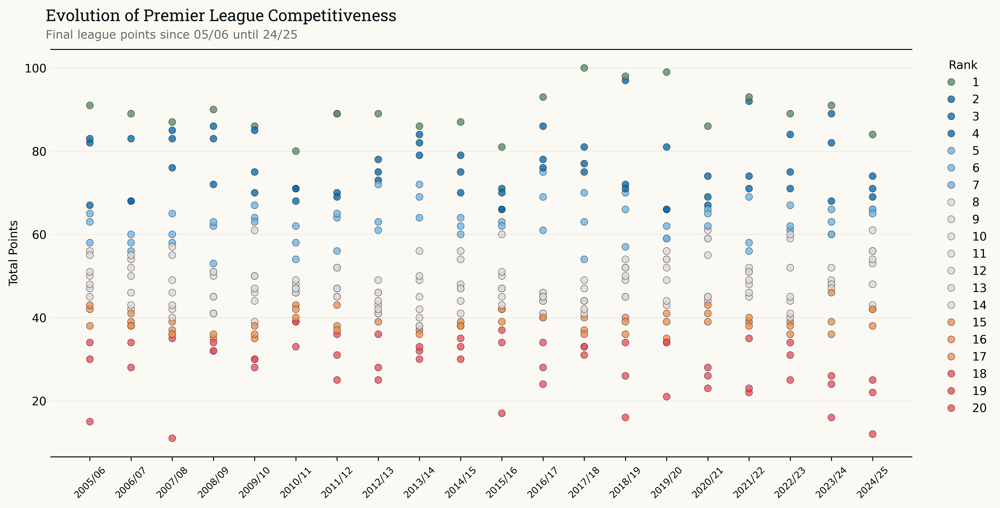

# Premier League Trend Analysis

Analysis of English Premier League match data from 2005/06 to 2024/25, exploring competitive trends, league standings evolution, and performance patterns.

## Project Overview

This project analyzes two decades of Premier League data to identify:
- Evolution of points required for different league positions
- Rising standards at the top of the table
- Consistency of relegation thresholds
- Competitive balance and tier stratification
- Season-by-season variance in league competitiveness


## Installation

This project uses `uv` for dependency management.

### Prerequisites
- Python 3.10+
- uv package manager

### Setup

1. Clone the repository:
```bash
git clone <repository-url>
cd epl_trend_analysis
```

2. Install dependencies using uv:
```bash
uv sync
```

This will create a virtual environment and install all required packages from `pyproject.toml`.

## Usage

Run the main analysis pipeline:

```bash
uv run python main.py
```

Or activate the virtual environment and run directly:

```bash
source .venv/bin/activate  # On Windows: .venv\Scripts\activate
python main.py
```

### Jupyter Notebooks

Explore the analysis interactively:

```bash
uv run jupyter notebook notebooks/exploration.ipynb
```

## Project Structure

```
epl_trend_analysis/
├── data/
│   ├── raw/                 # Original dataset
│   └── processed/           # Processed data files
├── figures/                 # Generated visualizations
│   └── club_logos/          # Team logo images
├── notebooks/
│   └── exploration.ipynb    # Exploratory analysis
├── src/
│   ├── data_processing.py   # Data cleaning and transformation
│   └── visualize.py         # Visualization functions
├── main.py                  # Main pipeline orchestration
├── pyproject.toml           # Project dependencies
└── README.md
```

## Data Source

Dataset: English Premier League Match Data (2000-2025)
- Source: [Kaggle - marcohuiii/english-premier-league-epl-match-data-2000-2025]
- Coverage: Seasons 2005/06 through 2024/25
- Features: Match results, goals, team standings, points

## Visualizations

The main visualization shows:
- **X-axis**: Season (2005/06 - 2024/25)
- **Y-axis**: Total points
- **Color**: Final league position (rank 1-20)
- **Patterns**: Trends in competitiveness and performance standards



## Dependencies

Key packages:
- `pandas` - Data manipulation
- `seaborn` - Statistical visualizations
- `matplotlib` - Plotting
- `jupyter` - Interactive notebooks

See `pyproject.toml` for complete dependency list.

## Replication

To replicate the analysis:

1. Install dependencies: `uv sync`
2. Run the pipeline: `uv run python main.py`
3. View outputs in `figures/` directory
4. Explore notebooks for detailed analysis

## License
MIT License

## Contact

www.mohammadiman.com
